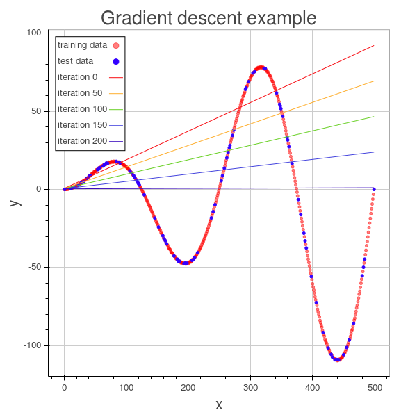
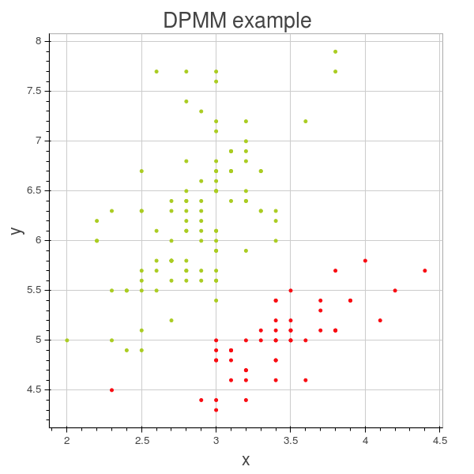

# riderml
I heard somewhere that true understanding in computer science is equal parts intuition, math, and implementation.  This project contains machine learning algorithms that I have implemented for fun and my own education.

# Organization
The algorithms are split into categories:
 - neural_network contains neural network code
 - regression contains gradient descent algorithms
 - visualization contains code for visualizing examples for each algorithm
 - tests contains unit tests

# What ML algorithms are there now?
Currently the project contains feed-forward neural networks and gradient descent.  The neural network implementation is written in such a way that it should be easily extensible.  For example, each layer takes a series of functions for forward and backward propagation and so on, that could easily be swapped out.

#### Neural networks
- a generic layer model and the functions to use it as a component of a neural network.
- backprop with irprop-
- 
###### Autoencoders
generic autoencoder with optional normalization for sparse denoising autoencoders.

###### Deep belief networks
deep belief networks -- arbitrary number of layers with greedy autoencoder pretraining.

#### Gradient descent
- iRPROP- gradient descent with mini-batches or full data set
- adagrad
- 
#### Factorization Machines
2-way factorization machines with adaptive learning rate (TODO: no regularization yet)

#### Topic models
- latent dirichlet allocation
- dirichlet process mixture models with arbitrary mixture distributions (only guassian and multinomial implemented) -- see Neal 2006

# Visualization
Presently there are two approaches to visualization present in the repo. I originally used matplotlib but I have been increasingly using Bokeh.

# Requirements
You'll need scipy, numpy, matplotlib, and bokeh.

# Support
I have a bunch of implementations of other algorithms and I will add them in no particular order and at no particular time....

If you would like to contribute, please go right ahead.
